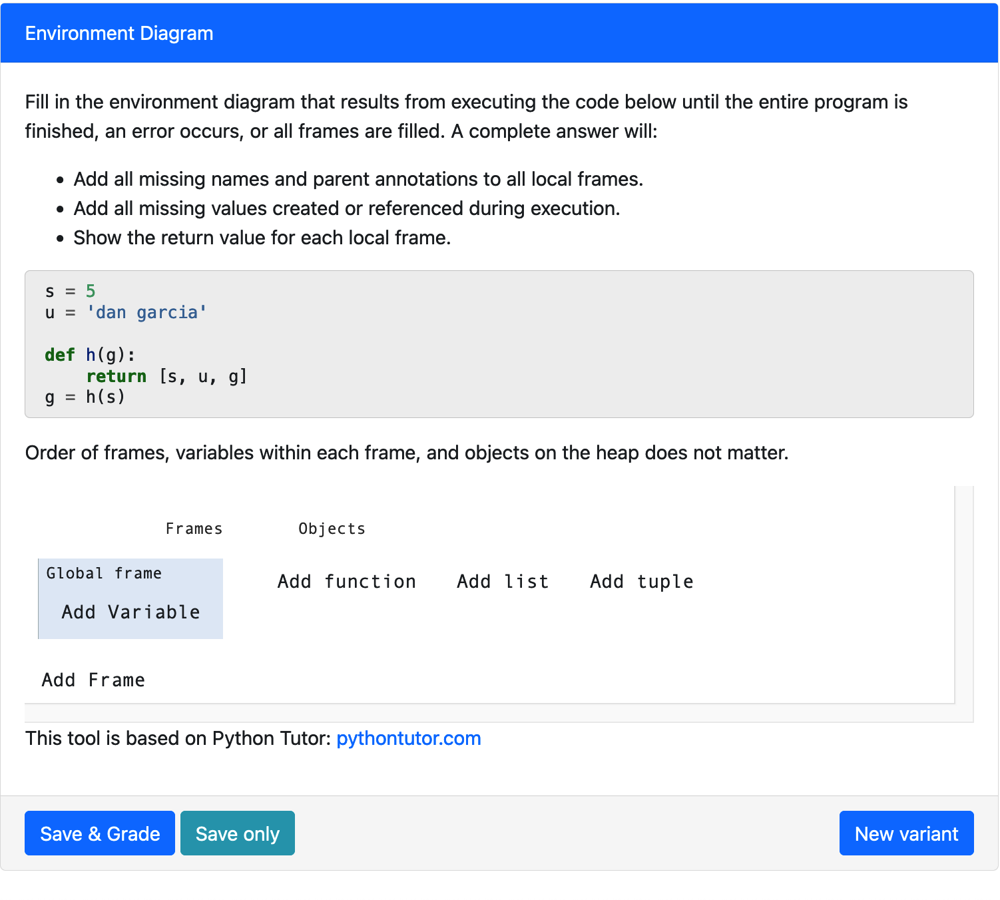
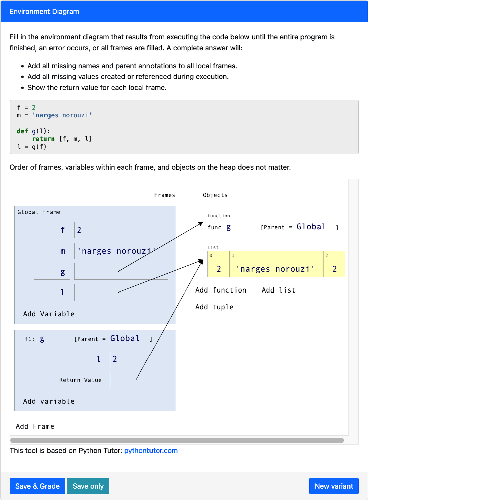

# Welcome to PL Environment Diagrams!

## Getting Started
To get the PrairieLearn Environment Diagram environment locally, please clone the main branch of this Github repository.
https://github.com/gabeclasson/pl-ucb-environmentdiagrams 

### Docker Setup
In order to get the PrairieLearn docker image set up in your system, please follow the instructions documented [here](https://prairielearn.readthedocs.io/en/latest/installing/).

### Navigating the Codebase

What you’ll find within this version of PrairieLearn are the following updates
* `elements/pl-env-diagram/` directory: This is the core Environment Diagram element within PrairieLearn. Feel free to read through it, but to author a question, there is no need to touch this section in order to author a question.
Included here are grading files and the javascript that makes the Environment Diagrams run!
* `questions/` directory: Here are three questions that we’ve written to demonstrate the ability to author a PrairieLearn Environment Diagram question. When you load the PrairieLearn environment in, you should see these questions populate under the course called Environment Diagrams: Environment Diagrams. In your work to author a question, this is the directory that you’ll be operating under so let’s dive deeper into that.


## Questions/ Directory
For each question directory, there will be five files that you’ll need to create. Let’s walk through an example within the `env_diagram_simple_list` question (the first one within the `questions/` directory). The `env_diagram_simple_list` question has a `info.json`, `Qgen_customization.py`, `question_gen.py`, `question.html`, and `server.py` file. For the purposes of authoring a question, feel free to copy and paste the exact files over to create a new question. We’ll walk through the steps to modify these to create your own new questions!

### `info.json`
**You will need to edit this file.**
* This is the standard `info.json` file that each PrairieLearn question has. For this file, make sure to:
* Change the uuid to be unique
* Make a fun title for your question (Please don't keep it as ”Environment Diagrams”)
* Keep the topic as ”Environment Diagrams”, type as ”v3”, `singleVariant` as false (since we want to create randomness!), and `partialCredit` to true

### `question_gen.py`
**You will not need to edit this file, but can if you would like.**
The purpose of this file is to do the question generation via randomness (via `generate_question` and `replace` methods). If you would like to modify this file you can, but it is not recommended. You should be able to do all the randomization you need using another file. 

However, you should pay attention to the built-in options for generating variable and function names—this will become useful to you when you create random variants of your questions. For example, let’s look at the `common_variable_names` variable. We define `common_variable_names` to be common letters used for variables (a, b, x, y, and z) –feel free to use this when defining variable names! Feel free to look at the other options for naming variables and functions (`lowercase_letters`, `uppercase_letters`, `common_variable_names`, and `common_function_names`).

Also notice our ability to generate random variable values. Namely, we have small_int (which replaces numerical values with an integer between -15 and 99. We also have `letter_str` and `digit_str` to get a singular letter (upper or lowercase) or digit. Play around with these!

### `question.html`
**You will not need to edit this file.**
This file will generate the HTML that will be rendered for each question. Since Environment Diagram questions should all look the same. We particularly modeled our format off the Berkeley CS61A Fall 2019 Midterm 1 Environment Diagram Question 2 since this was the most recent time that students truly had a “fill in the entire Environment Diagram” experience in Berkeley 61A, one of the introductory coding classes at Berkeley.

You’ll notice in this file that we include a codestring: this is the generated `code_string` that you will write, once transformed via `question_gen.py`.

### `server.py`
**You will not need to edit this file.**
Much like a lot of PrairieLearn `server.py` files, this does the work of actually pulling from the question generating packages to generate the Environment Diagram question. There is no customization here for you to do.

### `Qgen_customization.py`
**You will need to edit this file.**
This is where the bulk of your work goes. Let’s walk through each section. We also have documentation within the sections themselves.

<em>Optional: You can change the name of this file to more accurately reflect what kind of question you are writing, but will need to modify the import statement in server.py to match the new file name.</em>

#### `code_string`
Place your base code string here. This would be effectively the same as the code that you’d provide to students if there was only one version of the problem.

Ensure to keep new lines and indentations like a normal Python interpreter would require!


```code_string = """ 
a = 5
b = "hello"
def f(c):
    return [a, b, c]
c = f(b)
"""
```

For example, here `a = 5` would be noted as line 0.

#### `allowed_names`
This is a dictionary that maps names from your code_string to a list of possible replacements. For example, I could set the variable `a` within `env_diagram_simple_list` to be `[question_gen.lowercase_letters, “Gabe”, “Noemi”, “Ashley”]`, which would, at question generation, replace the variable `a` with the chosen `lowercase_letter` from the lambda in  `question_gen.py` or one of the strings `”Gabe”`, `”Noemi”`, or `”Ashley”`. You can replace any and all variable and function names. Hint: as a reminder, you can look back at` question_gen.py` for all built-in randomness types for help!


Try to randomize at least two variables/functions in your authoring!

#### `allowed_assignment_values`
Now that we’ve randomized all possible functions and variable names, let’s also randomize assignments. What `allowed_assignment_values` does is allow you to re-assign the right hand side of an assignment statement (after `a =`). Thus, `allowed_assignment_values` maps the line that the assignment occurs on (0-indexed) to a list of all the possible replacements as strings. 

Note: Our 0-indexing includes comments and starts at the first non-whitespace line.

For instance, looking at `env_diagram_simple_list`’s `allowed_assignment_values`,
* Line 0 (`a = 5`): We can replace the 5 (the right side of the =) with a `question_gen.small_int`
* Line 1 (`b = “hello”`): We can replace the `”hello”` (the right side of the =) with `"bok"`, `"cvijet"`, `"morski pas"`, `"dan garcia"`, `"armando fox"`, or `"narges norouzi"`
* Line 4 (`c = f(b)`):  We can replace the `f(b)` (the right side of the =) with `f(b)`, `f(a)`, `f(9)`, or `f('plavu')`

Note: Every possible option is wrapped in quotes within the list. For example, for the replacement of line 4, we have the list `[“f(b)”, “f(a)”, “f(9)”, “f(‘plavu’)”]`.

**Be careful** doing this: changing variable assignments can change the way your entire question works! For instance, imagine a question which contains a list, `plist`. If we modify an assignment statement for `plist` which sets it to be a list to be `plist = “a”` or `plist = 1`, this is removing a core portion of what the question is testing or could break the question if future lines of code depend on `plist` being iterable.


### `special_replacements`
Special replacements are for modifications to the code that are not covered by `allowed_names` or `allowed_assignment_values`. Say for example you want your autogenerated code to include any of the following pieces of code on line 5:
`c += [5]` OR   `c.append(a)` OR   `c.extend([5])` OR   `a = c[0] + 9`
In this case, the above replacements would not be sufficient to allow for all of these options. But with `special_replacements` we can make this modification. `special_replacements` works through simple regex replacement, so you will have to provide a substring to replace as a key and a list of possible replacements (as with previous replacement types, functions provided will be used to generate the replacement, lists will be used to randomly select, and strings will directly be used as a replacement.) If you want to use special_replacements, you should include a sequence of characters that is unlikely to appear naturally in code in your codestring so that intentional parts of the code do not accidentally get overwritten. `special_replacements` is performed before name or value replacement, so don’t worry about other modifications to code when deciding a key. 

If I were to implement the above example usecase of `special_replacements`, I would modify my codestring to look like something like this:

```code_string = """ 
a = 5
b = "hello"
def f(c):
    return [a, b, c]
c = f(b)
$%^1^%$
"""
```

And then set:

`special_replacements = {"$%^1^%$": ["c += [5]", "c.append(a)",   "c.extend([5])","a = c[0] + 9]"]}`

### Example Output

We used all of the previous examples (except special replacements) to create our example question in `env_diagrams_simple_list`. Here is what a potential result of what running that question in PrarieLearn may look like:





## Task Checklist
- [ ] Cloned the Environment Diagram repository (found here).
- [ ] Built the environment and loaded from disk (via localhost:3000).
- [ ] Navigated the codebase (and played around/had fun!)
- [ ] Duplicated a base question (we recommend the env_diagram_simple_list question)
- [ ] Edited the info.json and Qgen_basic.py files as discussed above.
- [ ] Solved your own question! :)

Congrats, you have successfully authored a PrairieLearn Environment Diagram question! Give yourself a pat on the back.

Sincerely,
Gabe, Noemi, and Ashley

Here is a link to our group's [slidedeck](https://docs.google.com/presentation/d/19rc5fJAJRxillrcni0znCmDxr3anMgpYXDJRbrAilK8/edit#slide=id.g26d92601f0e_2_0), which we used to take notes and track progress throughout the semester.

